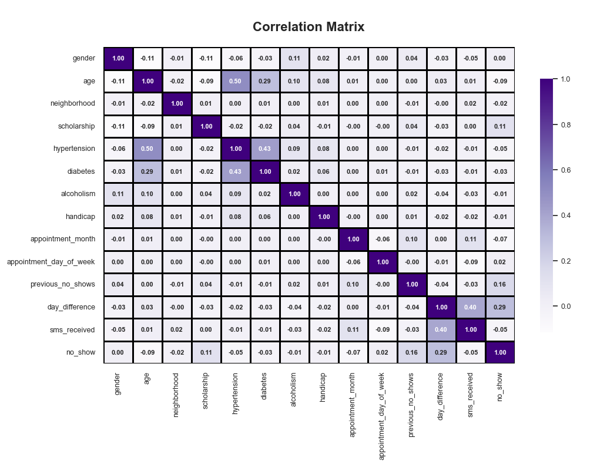
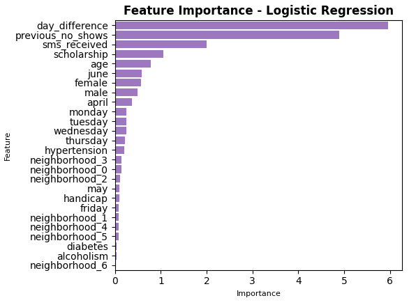
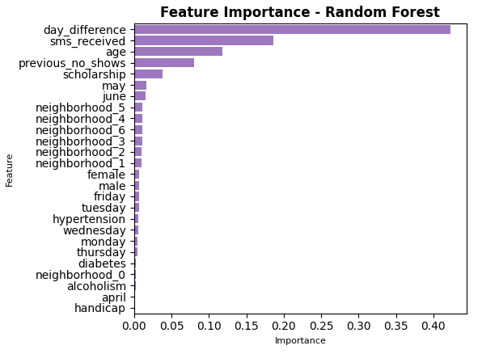

# Predicting Medical Appointment No-Shows

All descriptive and predictive analytics can be viewed in this repository's **notebooks/** folder. Check out the linked API to make real-time predictions with your appointment data!

## Dataset Description
The raw dataset (**data/raw_medical_appointment_data.csv**) contains 110,527 entries of patient appointment records from 2016, capturing a range of attributes that may impact attendance.

- **PatientId**: A unique identifier for each patient in the dataset.
- **AppointmentID**: A unique identifier for each appointment scheduled.
- **Gender**: The gender of the patient (e.g., 'F' for female, 'M' for male).
- **ScheduledDay**: The date and time when the appointment was scheduled, in the format YYYY-MM-DD HH:MM.
- **AppointmentDay**: The date of the scheduled appointment in the format YYYY-MM-DD.
- **Age**: The age of the patient in years.
- **Neighbourhood**: The neighborhood where the patient resides, represented as a categorical variable.
- **Scholarship**: A binary feature representing whether the patient has a scholarship (government subsidy).
- **Hipertension**: A binary feature representing whether the patient has hypertension.
- **Diabetes**: A binary feature representing whether the patient has diabetes.
- **Alcoholism**: A binary feature representing whether the patient has a history of alcoholism.
- **Handcap**: An integer indicating the number of handicaps a patient has, ranging from 0 to 4.
- **SMS_received**: A binary feature representing whether the patient received an SMS appointment reminder.
- **No-show**: A categorical target variable indicating whether the patient did not show up for the appointment ('Yes' for no-show, 'No' for attended).

## Data Exploration

### Chronological Trends

The highest no-show rate is observed for Friday appointments. Very few appointments took place on Saturdays and none occurred on Sundays. Because we removed Saturday appointments from the dataset, there is no weekday versus weekend relationship to consider.

Appointments primarily occurred in May and June, with several thousand taking place in April. The difference in days between when appointments were scheduled and when they took place is heavily right-skewed. Three-quarters of appointments occurred within 15 days of being scheduled, indicating most were addressing specific or urgent patient needs. The remaining quarter were scheduled 15 to 179 days in advance, indicating some routine checkups or non-urgent care. Observed no-shows include considerably more instances with large day differences compared to attended appointments.

### Core Patient Attributes

The female-to-male patient ratio in this dataset is nearly 2:1. This discrepancy may result from how the data was collected or simply suggest that female patients in the area require appointments more frequently than their male counterparts.

Patient age is slightly right-skewed, with a significant number of patients close to age 0. This likely reflects mothers scheduling appointments for their newborns, with the newborn's age being recorded rather than the mother's. Besides newborns, patient age extends from 18 years (first quartile) to 37 years (second quartile) to 55 years (third quartile), indicating a diverse patient population across various stages of human development.

79 unique neighborhoods are represented. The most populous neighborhoods account for thousands of appointments, while the least populous claim fewer than 50.

### Other Patient Attributes

The scholarship feature designates that a patient or family is low income and receives government subsidies, comprising less than 10% of entries. The scholarship patient group exhibits a substantially higher no-show rate.

In contrast, conditions such as hypertension, diabetes, and alcoholism are associated with slightly lower no-show rates when compared to patients without these attributes. Any effect the number of handicaps a patient has is unclear, likely due to the minimal amount of patients with two, three, or four handicaps.

Previous no-show counts were derived by matching unique patient ID between multiple appointments. Over 20,000 appointments involved a patient who had already missed at least one previous appointment.

### Feature Correlation

The correlation matrix of the cleaned dataset reveals several interesting relationships among the features. Given their known medical relationships, hypertension, diabetes, and age exhibit a high degree of correlation with one another. Additionally, day_difference and sms_received show substantial correlation, as longer lead times provide more opportunity to send SMS reminders.

## Data Preprocessing and Model Training

For a streamlined workflow, dataset features were preprocessed once for all training purposes. This included encoding discrete variables and transforming/scaling continuous features, whether necessary for one or multiple model types. Subsequently, three machine learning models were trained and validated. Below is a breakdown of each relevant model, along with a summary of validation results. The table includes metrics achieved from the classification threshold that achieved the highest F1 score. Adjusting that 'optimal' threshold value involves a tradeoff between precision, recall, and the other metrics.

### Logistic Regression

Compatible with binary output, logistic regression was evaluated using k-fold cross-validation and grid search for hyperparameter tuning. The best logistic regression resulted from a C value of 100 and L2 (Ridge) regularization. 

### Deep Neural Network 

As a more computationally intensive alternative, the deep neural network (DNN) was trained using stratified k-fold cross-validation. This custom DNN features two hidden layers and an output layer with a sigmoid activation function. Hyperparameter tuning was ommitted for performance reasons. Hyperparameter tuning was omitted due to limited computing resources, but the neural network's capacity to capture complex relationships allowed it to achieve similar performance to logistic regression. For most thresholds, it demonstrated higher precision but lower recall compared to logistic regression. When this neural network predicts an appointment to be a no-show, it is highly likely to be correct. However, its conservative approach to identifying such outcomes means that a significant number (almost half) of the true no-show appointments are not being classified as no-shows.

### Random Forest

Given its larger number of hyperparameters, the random forest was implemented with 10 iterations of random search. The best combination of hyperparameters found included 100 trees, a minimum of 5 samples for node splitting, a minimum of 3 samples per leaf node, and a maximum tree depth of 20. The random forest's performance is comparable to the deep neural network; summatively, it has slightly outperformed both other models by achieving the highest F1 score and AUC-ROC. The AUC-ROC curve for this model features a strikingly vertical section on the left: as the true positive rate increases from 0 to nearly 0.5, the false positive rate remains at 0. In this region of the curve, we can say that the small proportion of appointments classified as no-shows by the random forest are extremely certain to be actual no-shows.

| Model                | Accuracy | Precision | Recall | F1 Score | AUC-ROC |
|:---------------------|:--------:|:---------:|:------:|:--------:|:-------:|
| Logistic Regression   | 0.778    | 0.648     | 0.634  | 0.641    | 0.739   |
| Deep Neural Network    | 0.833    | 0.851     | 0.562  | 0.677    | 0.759   |
| Random Forest          | 0.830    | 0.806     | 0.601  | 0.688    | 0.768   |

## Project Significance

While the order of importance varies across models, the three most prominent features are the day difference between scheduling and appointment, the patient's previous no-show count, and SMS notification receipt. Scholarship status and patient age are also significant, though less so. Day of the week, gender, and neighborhood show mild relevance depending on the model.

In hindsight, features engineered from the initial dataset's columns proved to be the most important, while raw patient attributes such as hypertension, diabetes, alcoholism, and handicap had little impact on predictions. All three models demonstrated somewhat passable performance on this dataset, but the data itself is likely the limiting factor on performance.

There is considerable room for improvement with a richer dataset. Appointments spanning months or years would provide more comprehensive insights, while incorporating appointment context (purpose, practitioner, etc.) could enhance predictive power. Additionally, measuring attendance barriers—such as patient distance from the clinic, transportation access, and past no-show reasons—could significantly improve prediction accuracy.

These predictions can assist medical providers in operational decision-making by identifying high-risk appointments and consequently implementing proactive measures to improve appointment adherence. Understanding no-show factors can guide resource allocation and scheduling strategies, leading to more efficient clinic operations and enhanced patient care. This predictive capability ultimately contributes to reducing healthcare costs and improving patient outcomes, as consistent appointment attendance is crucial for effective health management and treatment.

  
  

